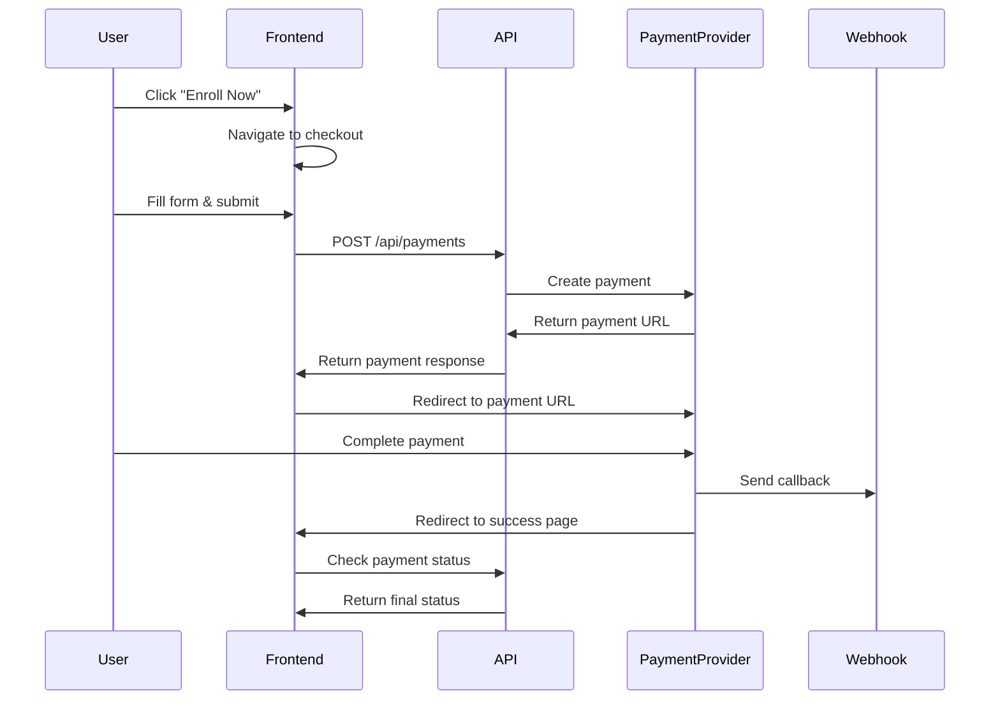

# Payment System Setup Guide

This document explains how to set up and use the payment system implemented with BYL and QPay integration.

## Overview

The payment system supports two Mongolian payment providers:
- **BYL**: Bank transfer and payment processing
- **QPay**: Mobile payment solution

## Environment Variables

The following environment variables are required for the payment system to work:

### BYL Configuration
```env
BYL_API_URL=https://byl.mn/api/v1
BYL_ACCESS_TOKEN=your_byl_access_token
BYL_PROJECT_ID=your_byl_project_id
```

### QPay Configuration
```env
QPAY_MERCHANT_CODE=your_qpay_merchant_code
QPAY_API_URL=https://merchant.qpay.mn/v2
QPAY_MCC_CODE=your_qpay_mcc_code
```

These are already configured in your `env.production` file.

## File Structure

### API Routes
- `/app/api/payments/route.ts` - Create payments
- `/app/api/payments/status/route.ts` - Check payment status
- `/app/api/payments/callback/route.ts` - Handle payment webhooks

### UI Components
- `/app/checkout/[courseId]/page.tsx` - Checkout page
- `/app/payment/success/page.tsx` - Payment success/status page
- `/components/course-card.tsx` - Updated with payment links

### Configuration
- `/lib/payment-config.ts` - Payment provider configuration
- `/types/payment.ts` - TypeScript type definitions

## How It Works

1. **Course Selection**: Users click "Enroll Now" on any course card
2. **Checkout**: Users are redirected to `/checkout/[courseId]` with course details
3. **Payment Processing**: Users fill out the form and select a payment method
4. **Payment Gateway**: System creates payment with chosen provider (BYL/QPay)
5. **Redirect**: Users are redirected to the payment provider's website
6. **Completion**: After payment, users return to `/payment/success` page
7. **Webhooks**: Payment providers send callbacks to `/api/payments/callback`

## Usage Examples

### Creating a Payment
```typescript
const paymentRequest = {
  provider: 'qpay', // or 'byl'
  amount: 349000,
  currency: 'MNT',
  description: 'Enrollment for Graphic Design + AI',
  orderId: 'order_123456',
  customerEmail: 'user@example.com',
  customerPhone: '+976-12345678',
  returnUrl: 'https://yoursite.com/payment/success',
  callbackUrl: 'https://yoursite.com/api/payments/callback'
}

const response = await fetch('/api/payments', {
  method: 'POST',
  headers: { 'Content-Type': 'application/json' },
  body: JSON.stringify(paymentRequest)
})
```

### Checking Payment Status
```typescript
const response = await fetch(
  `/api/payments/status?paymentId=${paymentId}&provider=${provider}`
)
const status = await response.json()
```

## Payment Flow



## Testing

1. Ensure environment variables are set
2. Start the development server: `npm run dev`
3. Navigate to `/courses`
4. Click "Enroll Now" on any course
5. Fill out the checkout form
6. Test with both QPay and BYL payment methods

## Security Considerations

- All API keys and secrets are stored in environment variables
- Payment callbacks should be verified for authenticity (implement signature verification)
- Always validate payment status on your server before granting access
- Use HTTPS in production for all payment-related operations

## Integration Notes

### BYL Integration
- Uses bearer token authentication
- Supports various payment methods through their API
- Provides transaction IDs for tracking

### QPay Integration
- Mobile-first payment solution
- Generates QR codes for mobile payments
- Popular in Mongolia for digital payments

## Webhook Configuration

Configure your payment providers to send webhooks to:
- Production: `https://edunewera.mn/api/payments/callback`
- Development: `http://localhost:3000/api/payments/callback`

## Next Steps

1. **Database Integration**: Connect payments to your user/course database
2. **Email Notifications**: Send confirmation emails after successful payments
3. **Admin Dashboard**: Add payment management to your admin panel
4. **Refund System**: Implement refund processing if needed
5. **Analytics**: Track payment conversion rates and popular payment methods

## Support

For payment provider specific issues:
- BYL: Contact their developer support
- QPay: Check their merchant documentation

For implementation issues, review the code comments and error logs.
